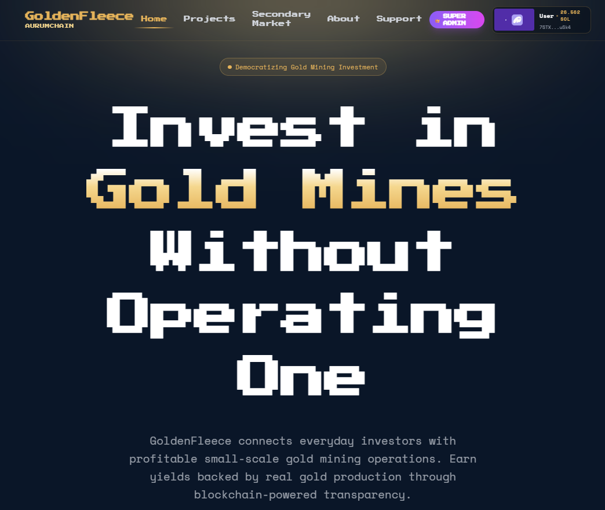
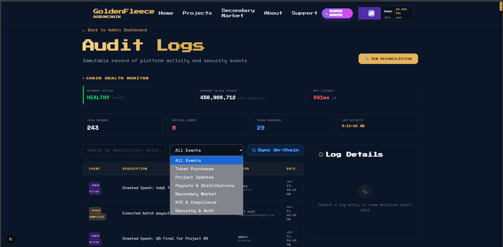
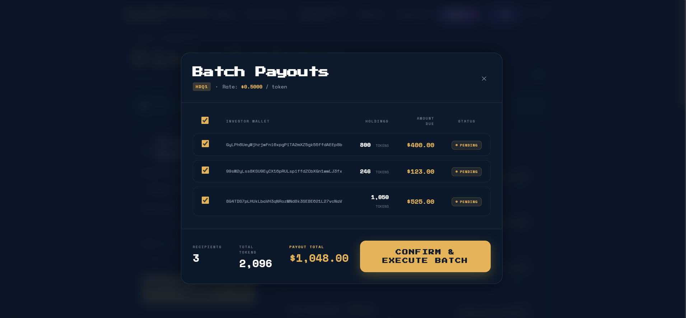
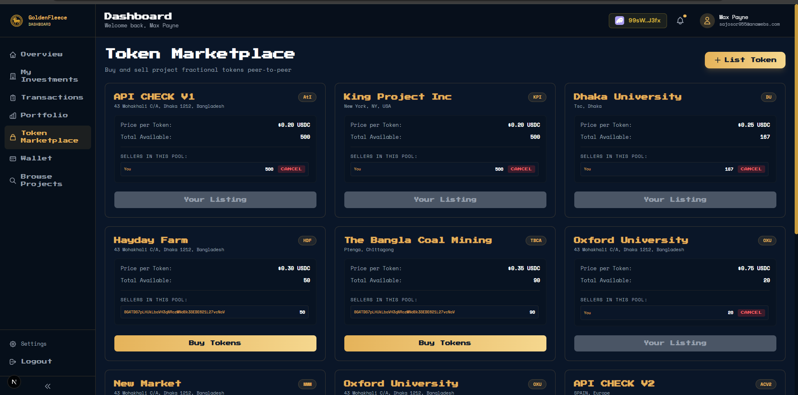
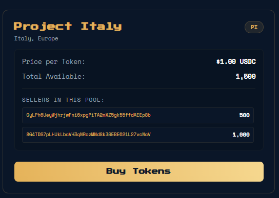
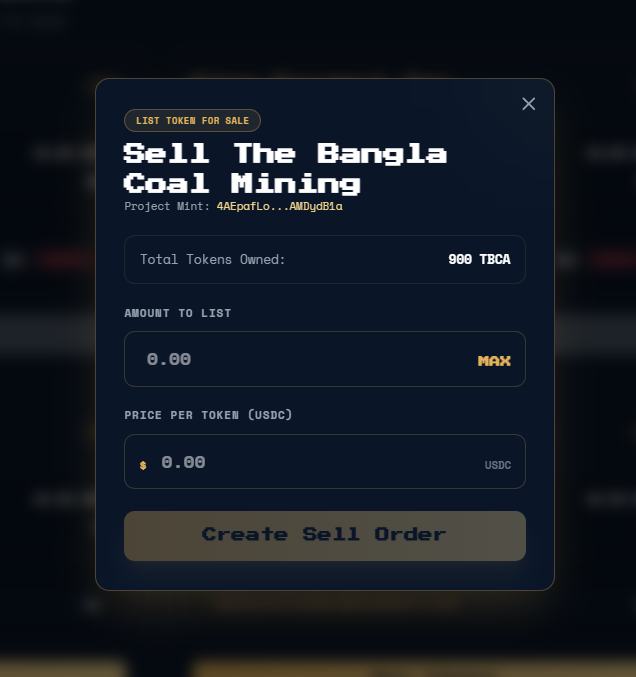
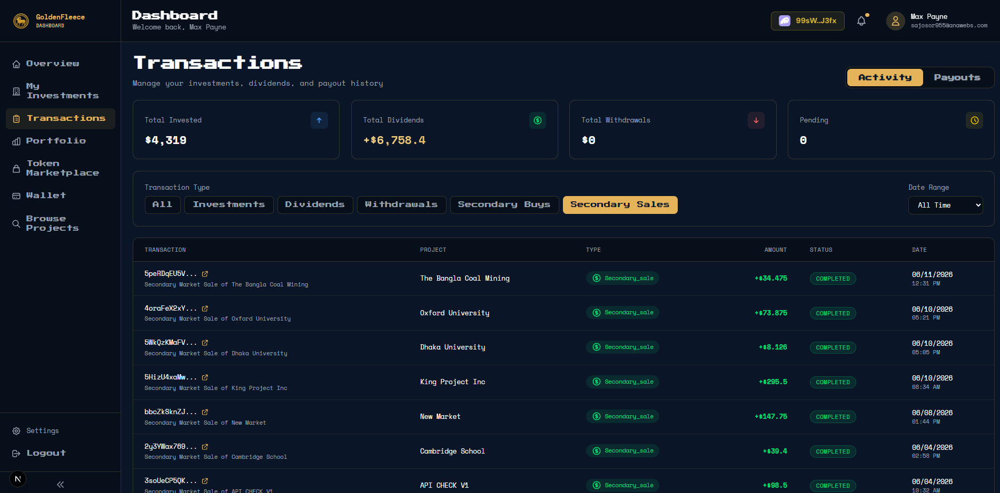

# AURUMCHAIN — Tokenized Gold Mine Investment Platform

[](https://nextjs.org/)
[](https://solana.com/)
[](https://www.typescriptlang.org/)
[](https://supabase.com/)
[](./LICENSE)

**AURUMCHAIN** is a full-stack tokenized investment platform enabling fractional ownership of real-world gold mining assets through Solana blockchain technology. Investors receive project-specific SPL tokens directly in their wallets, earn on-chain dividends, and can trade tokens peer-to-peer on a built-in secondary marketplace — all with enforced KYC compliance.

<p align="center">
  
</p>

---

## 📋 Table of Contents

- [Overview](#-overview)
- [Feature Highlights](#-feature-highlights)
- [Architecture](#-architecture)
- [Smart Contracts](#-smart-contracts--4-programs)
- [Directory Structure](#-directory-structure)
- [Getting Started](#-getting-started)
- [Available Scripts](#-available-scripts)
- [Application Pages](#-application-pages)
- [Screenshots](#-screenshots)
- [API Reference](#-api-reference)
- [Deployment](#-deployment)

---

## 🎯 Overview

AURUMCHAIN is built on three pillars:

1. **Zero-Trust Token Issuance** — Mint authority is transferred to a smart contract PDA immediately upon project creation. No human can mint tokens outside the program's rules.
2. **On-Chain Compliance** — Every token transfer (primary investment, dividend receipt, secondary trade) is gated by an on-chain KYC whitelist enforced by the `compliance_transfer` program.
3. **Peer-to-Peer Secondary Market** — After the lock-up period expires, investors can list and trade tokens directly on the platform's built-in orderbook without needing an exchange.

---

## ✨ Feature Highlights

| Feature                       | Description                                                                          |
| ----------------------------- | ------------------------------------------------------------------------------------ |
| **Project Registry**          | On-chain creation of investment projects with SPL token mints and Metaplex metadata  |
| **Compliance Layer**          | KYC-gated investor whitelisting enforced at the smart-contract level                 |
| **Investment Engine**         | USDC-based subscription → settlement → token allocation pipeline                     |
| **Direct-to-Wallet Delivery** | Tokens minted and delivered directly to investor Phantom wallets                     |
| **Token Lock-up**             | Tokens frozen on-chain until `lockup_end_date` passes                                |
| **Dividend Distribution**     | Pro-rata USDC payouts to all on-chain token holders via `allocation_distribution`    |
| **Secondary Market**          | Peer-to-peer orderbook with price-time priority matching and multi-seller fills      |
| **Admin Dashboard**           | Full lifecycle management: projects, KYC, investments, distributions, reconciliation |
| **Investor Dashboard**        | Portfolio tracking, payout history, marketplace access                               |
| **Audit Logs**                | Tamper-evident record of all on-chain and database events                            |

---

## 🏗️ Architecture

### Technology Stack

| Layer                | Technology                        | Purpose                                  |
| -------------------- | --------------------------------- | ---------------------------------------- |
| **Frontend**         | Next.js 16.1.4 (App Router)       | SSR, routing, UI                         |
| **Smart Contracts**  | Rust + Anchor 0.29                | Business logic on Solana                 |
| **Blockchain**       | Solana (Devnet → Mainnet)         | High-speed, low-cost settlement          |
| **Database**         | Supabase (PostgreSQL)             | Off-chain indexing, user data, orderbook |
| **Web3 Integration** | `@solana/web3.js` + Anchor client | RPC communication                        |
| **Wallet**           | Solana Wallet Adapter             | Phantom / Solflare support               |
| **Token Standard**   | SPL Token + Token-2022            | Fungible project tokens                  |
| **NFT Metadata**     | Metaplex Token Metadata Program   | Token name, symbol, logo                 |
| **Styling**          | Tailwind CSS 4                    | UI design system                         |
| **Auth**             | Supabase Auth (email/password)    | User authentication                      |
| **KYC**              | Sumsub SDK                        | Identity verification                    |

### Data Flow

```
Investor → Frontend (Next.js) → API Routes → Supabase DB
                                           ↕
                              Solana Smart Contracts (Anchor)
                                           ↕
                                  Phantom Wallet (on-chain state)
```

---

## ⚙️ Smart Contracts — 4 Programs

All programs are deployed on **Solana Devnet** and built with the Anchor framework.

| Program                   | Folder                              | Current Devnet ID                              | Purpose                                                                      |
| ------------------------- | ----------------------------------- | ---------------------------------------------- | ---------------------------------------------------------------------------- |
| `project_registry`        | `programs/project_registry/`        | `DZBcioGMWiriWXejSRYo3kjVJtS9VLe5RvwdUhr5HxJN` | Creates projects, mints SPL tokens, stores on-chain project state            |
| `compliance_transfer`     | `programs/compliance_transfer/`     | `BYg6sLi3UHLPB8de7J6Z3wAM5PcdV9T5HxtqBfuD85V9` | KYC whitelist, token freeze/unfreeze, transfer gating, sell order management |
| `allocation_distribution` | `programs/allocation_distribution/` | `EZXJQXX2vYoDrUP6JUcqeShhqKpSRuDecLK9JUiVzkTz` | Dividend epoch creation, pro-rata USDC payouts to token holders              |
| `secondary_market`        | `programs/secondary_market/`        | `8sQeYFf2kDEM33n3ZjnwEsMqwriR6eFNhjtAg7J5Lo6c` | Peer-to-peer sell orders, order filling, order cancellation                  |

> **Redeploying?** See [`docs/DEPLOYMENT_GUIDE.md`](./docs/DEPLOYMENT_GUIDE.md) for the full step-by-step guide including every file that needs updating when deploying under a new wallet address.

---

## 📁 Directory Structure

```
AURUMCHAIN/
│
├── app/                                  # Next.js App Router
│   ├── page.tsx                          # Landing page
│   ├── layout.tsx                        # Root layout
│   │
│   ├── admin/                            # Admin-only pages
│   │   ├── page.tsx                      # Admin dashboard overview
│   │   ├── projects/                     # Project management
│   │   ├── compliance/                   # KYC review & approval
│   │   ├── investments/                  # Investment management & finalization
│   │   ├── distributions/                # Payout epoch management
│   │   ├── audit-logs/                   # On-chain audit trail
│   │   ├── reconciliation/               # On-chain vs DB balance checks
│   │   └── authority/                    # Program authority management
│   │
│   ├── dashboard/                        # Investor dashboard
│   │   ├── page.tsx                      # Portfolio overview
│   │   ├── portfolio/                    # Token positions
│   │   ├── investments/                  # Investment history
│   │   ├── distributions/                # Payout history & claims
│   │   ├── marketplace/                  # Secondary market (buy + sell)
│   │   ├── transactions/                 # Transaction history
│   │   └── wallet/                       # Wallet management
│   │
│   ├── projects/                         # Public project listings
│   │   └── [slug]/                       # Individual project page
│   ├── secondary-market/                 # Public secondary market (read-only)
│   ├── auth/                             # Auth callback handlers
│   ├── login/                            # Login page
│   ├── signup/                           # Registration page
│   ├── onboarding/                       # Post-signup onboarding
│   ├── kyc/                              # KYC verification flow (Sumsub)
│   ├── account/                          # Account settings
│   ├── about/                            # About page
│   └── support/                          # Support page
│
├── app/api/                              # Next.js API Routes
│   ├── admin/                            # Admin-only endpoints
│   │   ├── projects/                     # Project CRUD
│   │   ├── investments/finalize/         # Finalize → mint tokens
│   │   ├── distributions/                # Payout management
│   │   ├── audit-logs/                   # Audit log retrieval & sync
│   │   └── reconciliation/               # Balance reconciliation
│   ├── projects/                         # Public project data
│   ├── investments/                      # Create & complete investments
│   ├── portfolio/                        # Portfolio summary & assets
│   ├── payouts/                          # Claim dividend payouts
│   ├── secondary-market/                 # Secondary market endpoints
│   │   ├── orderbook/                    # Aggregated orderbook
│   │   ├── listings/                     # Raw listings
│   │   ├── orders/create|confirm|cancel/ # Sell order lifecycle
│   │   └── buy/[confirm]/                # Buy order + confirmation
│   ├── wallet/                           # Wallet connect, sync, verify
│   ├── kyc/                              # KYC token & completion
│   ├── compliance/webhook/               # Sumsub webhook receiver
│   ├── auth/                             # Auth event logging
│   ├── indexer/                          # On-chain sync triggers
│   └── webhooks/solana/                  # Solana event webhook
│
├── programs/                             # Anchor Smart Contracts (Rust)
│   ├── project_registry/src/
│   │   ├── lib.rs                        # Program entrypoint
│   │   ├── idl.json                      # Compiled IDL (update after deploy)
│   │   ├── state/                        # On-chain account structs
│   │   └── registry_logic/              # Instruction handlers
│   ├── compliance_transfer/src/
│   │   ├── lib.rs
│   │   ├── idl.json
│   │   ├── state/
│   │   └── compliance_logic/
│   ├── allocation_distribution/src/
│   │   ├── lib.rs
│   │   ├── idl.json
│   │   ├── errors.rs
│   │   ├── state/
│   │   └── logic/
│   └── secondary_market/src/
│       ├── lib.rs
│       ├── idl.json
│       ├── errors.rs
│       ├── state.rs
│       └── market_logic/
│
├── lib/
│   ├── web3/
│   │   ├── config/
│   │   │   ├── programs.ts               # ← All 4 Program ID constants (update here!)
│   │   │   └── rpc.ts                    # RPC connection factory
│   │   ├── idl/                          # Frontend IDL copies (auto-synced)
│   │   │   ├── project_registry.json
│   │   │   ├── compliance_transfer.json
│   │   │   ├── allocation_distribution.json
│   │   │   └── secondary_market.json
│   │   ├── services/                     # Blockchain service classes
│   │   ├── clients/                      # Anchor program clients
│   │   └── utils/                        # Web3 helper utilities
│   └── supabase/                         # Supabase client factories
│
├── supabase/
│   └── migrations/                       # 25 ordered SQL migration files (001–022 + sync)
│
├── scripts/                              # CLI maintenance & debugging scripts
│   ├── manual-verify.ts                  # KYC approve user on-chain
│   ├── check-project.ts                  # Inspect on-chain project state
│   ├── check-mint.ts                     # Inspect SPL token mint
│   ├── verify-wallet.ts                  # Check wallet KYC status on-chain
│   ├── recover_payouts.ts                # Retry failed distributions
│   ├── recalculate-portfolios.ts         # Rebuild portfolio positions
│   ├── sync-onchain-balances.ts          # Pull chain balances to Supabase
│   ├── indexer_watcher.ts                # Background Solana event indexer
│   └── ...                              # 24 total scripts
│
├── tests/                                # Integration tests (Mocha)
│   ├── eligibility.ts                    # KYC / compliance tests
│   ├── subscription.ts                   # Investment flow tests
│   ├── tokenization.ts                   # Token minting tests
│   ├── secondary-market.ts               # Secondary market flow tests
│   └── simulate-full-flow.ts             # End-to-end simulation
│
├── docs/
│   └── DEPLOYMENT_GUIDE.md              # Full deployment reference
│
├── Anchor.toml                           # ← Program IDs for devnet (update here!)
├── .env.example                          # Environment variable template
├── package.json                          # Dependencies & npm scripts
└── tsconfig.json
```

---

## 🚀 Getting Started

### Prerequisites

- **Node.js** ≥ 18
- **npm** ≥ 9
- **Solana CLI** (latest stable)
- **Phantom Wallet** with Devnet enabled
- **Supabase** project (free tier works)

### Installation

```bash
# 1. Clone the repository
git clone https://github.com/RupomGg/AURUMCHAIN.git
cd AURUMCHAIN

# 2. Install Node dependencies
npm install

# 3. Set up environment variables
cp .env.example .env
# Edit .env with your Supabase keys, wallet private key, and program IDs
```

### Database Setup

Run all migrations in order in your Supabase SQL Editor:

```
supabase/migrations/001_... → 022_... → sync_redeploy.sql
```

### Sync IDLs

After any program redeployment, sync the IDL files to the frontend:

```bash
npm run sync-idl
```

### Run Development Server

```bash
npm run dev
# App available at http://localhost:3000
```

> [!IMPORTANT]
> For the full deployment setup — including starting the **background indexer** (`npx ts-node scripts/indexer_watcher.ts`), running database migrations, configuring environment variables, deploying smart contracts, and the complete operational walkthrough — read the **[Deployment Guide](./docs/DEPLOYMENT_GUIDE.md)**.

---

## 📜 Available Scripts

```bash
# Development
npm run dev              # Start Next.js dev server (with 4 GB memory limit)
npm run build            # Production build
npm run start            # Start production server
npm run lint             # ESLint check

# IDL Synchronisation
npm run sync-idl         # Copy all 4 program IDLs → lib/web3/idl/

# IDL Patching (if needed)
npm run patch-idl:compliance     # Patch compliance_transfer IDL
npm run patch-idl:registry       # Patch project_registry IDL
npm run patch-idl:distribution   # Patch allocation_distribution IDL

# User Management
npm run verify-user <email> <wallet>   # Approve investor KYC on-chain + DB

# Integration Tests
npm run test:eligibility         # KYC / compliance test suite
npm run test:subscription        # Investment flow test suite
npm run test:tokenization        # Token minting test suite
npm run test:secondary-market    # Secondary market test suite
npm run test:full-flow           # Full end-to-end simulation

# Unit Tests
npm run test                     # Jest unit tests
npm run test:watch               # Jest in watch mode
```

---

## 📱 Application Pages

### Public Pages

| URL                 | Description                       |
| ------------------- | --------------------------------- |
| `/`                 | Landing page                      |
| `/projects`         | Browse investment projects        |
| `/projects/<slug>`  | Individual project detail         |
| `/secondary-market` | Public secondary market orderbook |
| `/about`            | About AURUMCHAIN                  |
| `/support`          | Support / FAQ                     |
| `/login`            | Login                             |
| `/signup`           | Registration                      |
| `/onboarding`       | Post-signup guided setup          |
| `/kyc`              | KYC verification (Sumsub)         |

### Investor Dashboard (Auth required)

| URL                        | Description                        |
| -------------------------- | ---------------------------------- |
| `/dashboard`               | Portfolio overview                 |
| `/dashboard/portfolio`     | Token positions                    |
| `/dashboard/investments`   | Investment history                 |
| `/dashboard/distributions` | Payout history & claims            |
| `/dashboard/marketplace`   | Full secondary market (buy + sell) |
| `/dashboard/transactions`  | All transaction history            |
| `/dashboard/wallet`        | Wallet management                  |
| `/account`                 | Account settings                   |

### Admin Dashboard (Super Admin only)

| URL                     | Description                                 |
| ----------------------- | ------------------------------------------- |
| `/admin`                | Dashboard overview & KPIs                   |
| `/admin/projects`       | Create / manage projects                    |
| `/admin/compliance`     | KYC review: approve / reject investors      |
| `/admin/investments`    | All investments; finalize token delivery    |
| `/admin/distributions`  | Create distribution epochs; execute payouts |
| `/admin/audit-logs`     | On-chain + DB audit trail                   |
| `/admin/reconciliation` | On-chain vs DB balance reconciliation       |
| `/admin/authority`      | Program upgrade authority management        |

---

## 📸 Screenshots

### 🛡️ Admin Dashboard

**Super Admin Dashboard Overview**


**Project Management**


**Project Creation Form**


**Compliance & KYC Review**


**Investment Approval**


**Payout Epoch Creation**


**Payout Approval**


**Audit Log**


**Platform Authority Management**


---

### 💰 Investor Dashboard

**Investor Dashboard Overview**


**Investing Flow (Investor Side)**


**Payout History**


**Payout Modal**


**Transaction History**


---

### 🔄 Secondary Market

**Global Secondary Market (Public View)**


**Token Marketplace (User View)**


**FIFO Orderbook View**


**List Token for Sale**


**Token Listing Modal**


**Payout & Secondary Transactions**


---

## 🔗 API Reference

### Investor / Public

| Method | Endpoint                         | Auth | Description             |
| ------ | -------------------------------- | ---- | ----------------------- |
| `GET`  | `/api/projects`                  | No   | List all projects       |
| `GET`  | `/api/projects/[slug]/details`   | No   | Project details         |
| `POST` | `/api/investments/create`        | Yes  | Create investment       |
| `POST` | `/api/investments/[id]/complete` | Yes  | Mark investment settled |
| `GET`  | `/api/portfolio/summary`         | Yes  | Portfolio summary       |
| `GET`  | `/api/portfolio/assets`          | Yes  | Token positions         |
| `GET`  | `/api/portfolio/performance`     | Yes  | Performance metrics     |
| `POST` | `/api/payouts/claim/[id]`        | Yes  | Claim dividend payout   |

### Secondary Market

| Method | Endpoint                                      | Auth      | Description                           |
| ------ | --------------------------------------------- | --------- | ------------------------------------- |
| `GET`  | `/api/secondary-market/orderbook`             | No        | Aggregated price-level orderbook      |
| `GET`  | `/api/secondary-market/listings`              | No        | Raw listings (`?projectId=&status=`)  |
| `POST` | `/api/secondary-market/orders/create`         | Yes (KYC) | Build `list_sell_order` transaction   |
| `POST` | `/api/secondary-market/orders/confirm`        | Yes       | Record listing after confirmation     |
| `POST` | `/api/secondary-market/orders/cancel`         | Yes       | Build `cancel_sell_order` transaction |
| `POST` | `/api/secondary-market/orders/cancel/confirm` | Yes       | Mark listing cancelled                |
| `POST` | `/api/secondary-market/buy`                   | Yes (KYC) | Match + build multi-fill transaction  |
| `POST` | `/api/secondary-market/buy/confirm`           | Yes       | Update DB after purchase              |

### Wallet & KYC

| Method | Endpoint                  | Auth         | Description                  |
| ------ | ------------------------- | ------------ | ---------------------------- |
| `POST` | `/api/wallet/connect`     | Yes          | Link wallet to profile       |
| `GET`  | `/api/wallet/active`      | Yes          | Get active wallet            |
| `POST` | `/api/wallet/sync`        | Yes          | Sync wallet state from chain |
| `POST` | `/api/wallet/verify`      | Yes          | Verify wallet signature      |
| `GET`  | `/api/kyc/token`          | Yes          | Sumsub SDK token             |
| `POST` | `/api/kyc/complete`       | Yes          | KYC completion callback      |
| `POST` | `/api/compliance/webhook` | No (webhook) | Sumsub webhook receiver      |

### Admin

| Method      | Endpoint                              | Auth  | Description                       |
| ----------- | ------------------------------------- | ----- | --------------------------------- |
| `GET/POST`  | `/api/admin/projects`                 | Admin | List / create projects            |
| `GET/PATCH` | `/api/admin/projects/[id]`            | Admin | Get / update project              |
| `GET`       | `/api/admin/investments`              | Admin | All investments                   |
| `POST`      | `/api/admin/investments/finalize`     | Admin | Mint + deliver tokens             |
| `GET`       | `/api/admin/distributions/investors`  | Admin | Holder list for epoch             |
| `POST`      | `/api/admin/distributions/sync-batch` | Admin | Sync on-chain balances for payout |
| `GET`       | `/api/admin/audit-logs`               | Admin | Audit log entries                 |
| `POST`      | `/api/admin/audit-logs/sync-onchain`  | Admin | Sync on-chain events              |
| `POST`      | `/api/admin/reconciliation`           | Admin | Reconcile balances                |
| `POST`      | `/api/indexer/sync-epoch`             | Admin | Trigger holder sync               |
| `POST`      | `/api/webhooks/solana`                | HMAC  | Solana event webhook              |

---

## 📦 Deployment

### Current Devnet Program IDs

| Program                   | Address                                        |
| ------------------------- | ---------------------------------------------- |
| `project_registry`        | `DZBcioGMWiriWXejSRYo3kjVJtS9VLe5RvwdUhr5HxJN` |
| `compliance_transfer`     | `BYg6sLi3UHLPB8de7J6Z3wAM5PcdV9T5HxtqBfuD85V9` |
| `allocation_distribution` | `EZXJQXX2vYoDrUP6JUcqeShhqKpSRuDecLK9JUiVzkTz` |
| `secondary_market`        | `8sQeYFf2kDEM33n3ZjnwEsMqwriR6eFNhjtAg7J5Lo6c` |

### Files to Update When Redeploying

| File                          | What to Change                                            |
| ----------------------------- | --------------------------------------------------------- |
| `Anchor.toml`                 | All 4 program IDs under `[programs.devnet]`               |
| `programs/*/src/lib.rs`       | `declare_id!("...")` macro in each program                |
| `lib/web3/config/programs.ts` | Fallback strings for all 4 `PublicKey` exports            |
| `.env`                        | All 4 `NEXT_PUBLIC_*_PROGRAM_ID` variables                |
| `programs/*/src/idl.json`     | Replace with freshly exported IDLs from Solana Playground |

Then run: `npm run sync-idl`

> [!IMPORTANT]
> The deployment process also requires starting the **background indexer watcher** in a separate terminal:
>
> ```bash
> npx ts-node scripts/indexer_watcher.ts
> ```
>
> This long-running process keeps Supabase in sync with real-time on-chain events. **Without it, on-chain state changes will not be reflected in the database.** See [Phase 6.5 of the Deployment Guide](./docs/DEPLOYMENT_GUIDE.md) for full details.

See [`docs/DEPLOYMENT_GUIDE.md`](./docs/DEPLOYMENT_GUIDE.md) for the complete step-by-step deployment reference including migrations, user setup, and operational walkthrough.

---

## 📄 License

Proprietary — AURUMCHAIN Platform. All rights reserved.

---

Built with ❤️ by the AURUMCHAIN Team.
